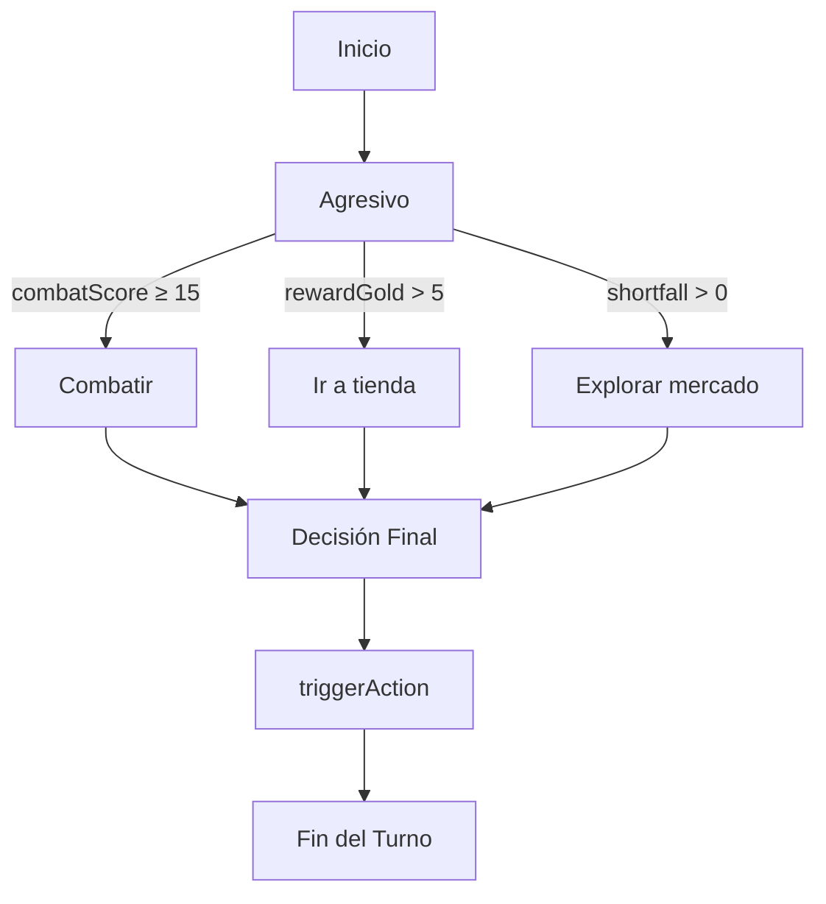

# 🤖 Documento Detallado de la Toma de Decisiones de los Bots (*Malditos Goblins*)

---

## 📁 Archivos Fuente Relevantes
- **[BotManager.js](file:///C:/Users/sorgar/ClaudeCode/js/BotManager.js)** – Lógica central de decisiones de los bots.
- **[CombatManager.js](file:///C:/Users/sorgar/ClaudeCode/js/CombatManager.js)** – Gestión del combate, asignación de dados y UI.
- **[database.js](file:///C:/Users/sorgar/ClaudeCode/js/database.js)** – Datos estáticos (equipamiento, goblins, roles, mejoras).

---

## 🧭 Visión General del Ciclo de Turno (Nivel Funcional)
Los bots siguen una **máquina de estados** gestionada por `BotManager.handleGameState()`. Cada fase del juego se traduce en acciones concretas que el bot lleva a cabo:

1. **Main (Escenario A)** – Decide si entrar al combate, comprar oro o usar un rol.
2. **Market (Escenario B)** – Compra recursos (curación, escudos, armas) según su estrategia.
3. **Combat (Escenario C)** – Asigna dados a armas, escudos o roles y decide cuándo reroll.
4. **Retaliation (Escenario D)** – Similar al combate pero con mecánicas de contraataque.
5. **Event (Escenario E)** – Responde a eventos especiales.

> **Nota:** En la versión actual del código **solo existe la personalidad *Agresivo***. Las personalidades *Conservador* y *Cooperativo* fueron eliminadas del `getPersonalityForDecision` y ya no influyen en la lógica de decisión.

---

## 🔎 Funciones Clave de Decisión (Resumen Funcional)
| Función | Qué hace (nivel funcional) |
|---|---|
| `getPersonalityForDecision(bot)` | Devuelve siempre la cadena **"Agresivo"**, ya que la lógica de otras personalidades ha sido removida. |
| `evaluateSurvivalOverride(bot)` | Antes de cualquier otra cosa, comprueba si la vida del bot está muy baja y, de ser así, fuerza una acción de curación o uso de rol para sobrevivir. |
| `calculateCombatScore(bot, goblins)` | Genera una puntuación que indica cuán atractivo es iniciar o continuar el combate. Usa datos de equipamiento, HP del equipo y peligrosidad de los goblins. |
| `performMainTurn(bot)` | Orquesta la decisión principal del bot fuera de combate: ¿combatir, comprar oro o usar un rol? |
| `performMarketTurn(bot)` | Decide qué comprar en la tienda (curación, escudos, armas) basándose en la urgencia de los recursos. |
| `performCombatTurn(bot)` | **Proceso detallado del combate**: determina qué dados asignar a qué equipamiento, cuándo reroll y contra qué goblin atacar. |

---

## 📋 Detalle Exhaustivo de Cada Paso (Funcional)
### 1️⃣ Recopilar el Estado del Tablero (`performMainTurn` & `performCombatTurn`)
- **Cantidad de goblins**: Lee `gameState.table.goblins.length`.
- **Cartas rotas**: Inspecciona `gameState.table.brokenCards`.
- **HP del equipo**: Calcula el promedio de vida de todos los bots vivos.
- **Equipamiento activo**: Consulta `bot.inventory.equipment`.
- **Roles disponibles**: Revisa `bot.roles`.
- **Recompensas de la ronda**: `gameState.currentRewards` (PEX y oro).
- **Nivel de oleada**: `gameState.wave`.

Con esta información el bot tiene una vista completa del tablero.

---

### 2️⃣ Decisión de Supervivencia (`evaluateSurvivalOverride`)
- Si **HP ≤ 30 %** del máximo, se prioriza *curación*.
- Busca curación disponible por **≤ 2 oro**.
- Si el bot posee el rol **Sanador**, lo activa inmediatamente.
- Sólo si estas condiciones no se cumplen, continúa con el flujo normal.

---

### 3️⃣ Cálculo de la Puntuación de Combate (`calculateCombatScore`)
Fórmula funcional:
```
score = (weaponPower * 0.4) + (shieldValue * 0.3) + (avgTeamHP/10 * 0.2) - (expectedGoblinDamage/5 * 0.5) + (rewardPEX + rewardGold/2) * 0.1 + personalityWeight
```
- `personalityWeight` es **+5** (única personalidad *Agresivo*).
- Umbral **15** indica que el combate es rentable.

---

### 4️⃣ Flujo Principal de Decisión (`performMainTurn`)
1. **Supervivencia** → posible acción de curación.
2. **Personalidad** → siempre *Agresivo*.
3. **Recopilar estado del tablero** (ver paso 1).
4. **Calcular `combatScore`** (ver paso 3).
5. **Reglas de decisión (única rama Agresivo)**:
   - Si `combatScore ≥ 15` → **Combatir**.
   - Si la recompensa de oro es alta (`rewardGold > 5`) → ir a la tienda.
   - Si la tienda muestra déficit de oro (`shortfall > 0`) → explorar el mercado.
6. **Generar burbuja informativa** con la razón de la decisión.
7. **Ejecutar** la acción mediante `triggerAction`.

---

### 5️⃣ Decisiones en el Mercado (`performMarketTurn`)
- **Urgencia de curación**: Si HP ≤ 25 % → compra curación (máx 2 oro).
- **Escudos**: Compra si el bot no tiene escudo o su nivel es bajo.
- **Armas**: Compra si `damage / cost > 1.2`.
- **Déficit de oro**: Si falta oro, ejecuta `explore-market`.

---

### 6️⃣ Detalle del Combate (`performCombatTurn`)
#### 6.1. Preparación del Estado
- **Goblins**: `gameState.table.goblins` (hp, attack, dangerLevel).
- **Dados disponibles**: `bot.dicePool` (blancos, negros, rojos).
- **Equipo**: `bot.inventory.equipment`.
- **Rol activo**: `bot.currentRole` (si tiene energía suficiente).

#### 6.2. Reroll de Dados Negros
- Suma valores de dados negros.
- Si suma **< 5** (única regla para Agresivo) → clic en **Reroll**.

#### 6.3. Cálculo de Daño Entrante
```javascript
incomingNormalDmg = goblins.reduce((s,g)=>s+g.attack,0);
incomingBlackDmg = blackDiceValues.reduce((s,v)=>s+v,0);
totalIncoming = incomingNormalDmg + incomingBlackDmg;
```

#### 6.4. Prioridades de Asignación de Dados (Funcional)
1. **Rol** – Si `bot.energy` suficiente y `totalIncoming < bot.currentHP * 0.2`, asigna dado alto al rol.
2. **Armas** – Ordena armas por daño y asigna los dados de mayor valor.
3. **Intercepciones** – Busca goblins peligrosos (`dangerLevel ≥ 3`) y asigna dados que superen su ataque para bloquear.
4. **Matar goblin** – Si la suma de dados restantes supera el `hp` de un goblin, ataca para eliminarlo.
5. **Escudos** – Dados de menor valor se asignan al escudo para incrementar defensa.

#### 6.5. Secuencia UI
- Cada asignación se traduce en `click('#die-X')` + `click('#weapon-slot')` o `click('#goblin-Y')`.
- Al final, se muestra una burbuja con texto agresivo (e.g., "¡A destruir esos goblins!").
- Se pulsa `#btn-resolve-combat` para resolver.

---

## 📊 Diagrama de Decisión (Única Personalidad Agresiva)


---

## 📚 Referencias a Datos (`database.js`)
- **Equipamiento**: `weapons[]`, `shields[]` con `damage`, `defense`, `cost`.
- **Goblins**: `goblins[]` con `hp`, `attack`, `dangerLevel`.
- **Roles**: `roles[]` con `energyCost`, `effect`.
- **Recompensas**: `rewards[]` con `pex`, `gold`.

---

## 🛠️ Extensibilidad y Personalización
- **Añadir nuevas personalidades**: Ampliar `getPersonalityForDecision` y crear ramas de decisión en `performMainTurn` y `performCombatTurn`.
- **Ajustar umbral de combate**: Cambiar la constante `COMBAT_SCORE_THRESHOLD` en `BotManager.js`.
- **Agregar recursos** (p.e. fichas de evento) → actualizar `database.js` y ampliar `evaluateSurvivalOverride` y `performMarketTurn`.

---

## 📦 Archivo Generado
El documento completo está guardado en:

[BotDecisionFlow.md](file:///C:/Users/sorgar/ClaudeCode/BOT_DECISION_FLOW.md)

---

*Este documento muestra, a nivel funcional, **exactamente** qué información utiliza el bot, cómo la procesa y qué decisiones toma en cada fase del juego, con la aclaración de que solo la personalidad *Agresivo* está activa.*
