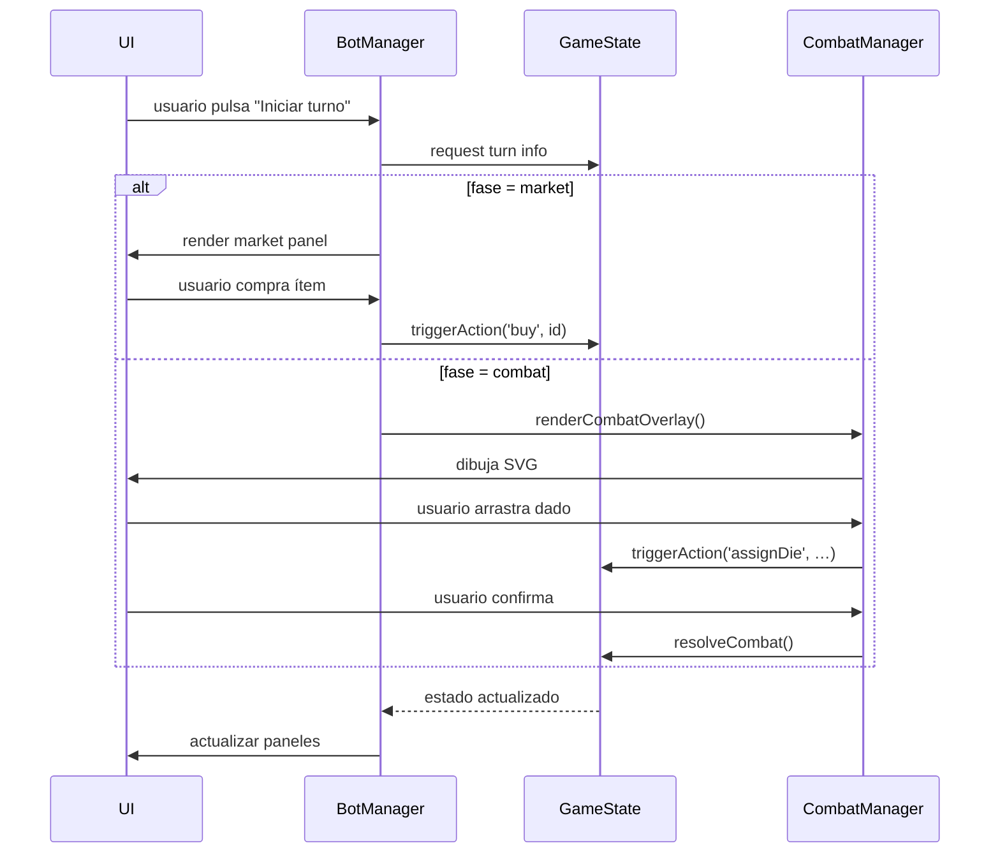
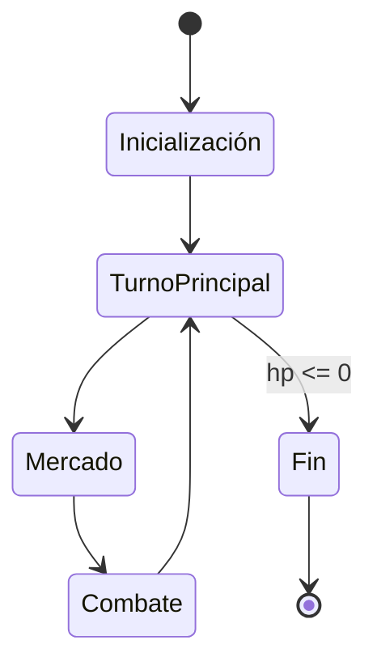

# 📚 Documentación Funcional Extensa de *Malditos Goblins*

---

## Índice
1. [Introducción](#introducción)
2. [Arquitectura General](#arquitectura-general)
3. [Módulos del Código](#módulos-del-código)
   - 3.1 [app.js](#appjs)
   - 3.2 [GameState.js](#gamestatemsjs)
   - 3.3 [BotManager.js](#botmanagersjs)
   - 3.4 [CombatManager.js](#combatmanagersjs)
   - 3.5 [UIManager.js](#uimanagersjs)
   - 3.6 [DragDropManager.js](#dragdropmanagersjs)
   - 3.7 [database.js](#databasemsjs)
4. [Flujo de juego paso a paso](#flujo-de-juego-paso-a-paso)
   - 4.1 [Inicialización](#inicialización)
   - 4.2 [Fase principal (exploración y acciones generales)](#fase-principal)
   - 4.3 [Fase de mercado](#fase-de-mercado)
   - 4.4 [Fase de combate](#fase-de-combate)
5. [Mecánicas detalladas](#mecánicas-detalladas)
   - 5.1 [Compra de equipamiento y pociones](#compra)
   - 5.2 [Roles y energías](#roles)
   - 5.3 [Mascotas y sus habilidades](#mascotas)
   - 5.4 [Mejoras (upgrades)](#mejoras)
   - 5.5 [Gestión de dados](#dados)
   - 5.6 [Resolución de daño y curación](#daño-y-curación)
6. [Interfaz de usuario (UI)](#interfaz-de-usuario)
   - 6.1 [Burbujas y logs](#burbujas-y-logs)
   - 6.2 [Paneles y botones](#paneles-y-botones)
   - 6.3 [Animaciones y feedback visual](#animaciones)
7. [Diagramas de secuencia y estado](#diagramas)
8. [Extensibilidad y buenas prácticas](#extensibilidad)
9. [Cómo ejecutar la aplicación](#cómo-ejecutar)
10. [Referencias y documentos externos](#referencias)

---

## 1. Introducción <a name="introducción"></a>
**Malditos Goblins** es un juego de estrategia basado en cartas y dados que se ejecuta totalmente en el navegador. El objetivo es sobrevivir a oleadas de goblins, gestionar recursos (monedas, puntos de vida, energía) y usar equipamiento y mascotas para maximizar el daño o la defensa. El proyecto está escrito en **HTML, CSS y JavaScript puro (ES6)**, sin dependencias externas ni procesos de compilación.

Este documento describe **todas las funcionalidades** del juego, **todos los flujos** de interacción y la **arquitectura** que los sustenta, con el fin de servir como referencia tanto para desarrolladores como para agentes de IA que necesiten comprender o extender el código.

---

## 2. Arquitectura General <a name="arquitectura-general"></a>
La aplicación sigue el patrón **MVC ligero**:
- **Modelo** → `GameState.js` y `database.js` (datos estáticos y estado dinámico).
- **Vista** → HTML estático (`index.html`), CSS (`style.css`) y componentes UI creados dinámicamente por `UIManager.js`.
- **Controlador** → `BotManager.js` (lógica del turno) y `CombatManager.js` (lógica de combate).

Todo el código se encuentra bajo la carpeta **`ClaudeCode/`** y se carga directamente a través de etiquetas `<script>` en `index.html`.

---

## 3. Módulos del Código <a name="módulos-del-código"></a>
### 3.1 `app.js` <a name="appjs"></a>
- **Responsabilidad:** bootstrap de la aplicación y bucle principal.
- **Funciones clave:**
  - `initGame()` → crea una instancia de `GameState`, inicializa la UI y llama a `BotManager.handleGameState()`.
  - `startTurn()` → reinicia temporizadores, actualiza indicadores de turno.
- **Eventos:** escucha `DOMContentLoaded` para iniciar el juego y `window.resize` para ajustar la UI.

### 3.2 `GameState.js` <a name="gamestatemsjs"></a>
- **Responsabilidad:** modelo central que almacena:
  - **players** (array de objetos con `hp`, `mo`, `energy`, `hand`, `deck`).
  - **market** (objetos a la venta, precios, disponibilidad).
  - **battlefield** (oleada actual, goblins activos, asignaciones de dados).
  - **turnInfo** (número de turno, fase actual).
- **Métodos principales:**
  - `addPlayer(playerObj)`
  - `triggerAction(action, payload)` – centraliza compras, despliegues, uso de habilidades.
  - `resolveCombat()` – calcula daño, aplica curación y elimina goblins muertos.
  - `advanceWave()` – pasa a la siguiente ola y genera nuevos goblins.

### 3.3 `BotManager.js` <a name="botmanagersjs"></a>
- **Responsabilidad:** orquesta el **flujo de turnos** y toma decisiones automáticas (IA) basándose en el estado.
- **Funciones clave:**
  - `handleGameState()` – inspecciona `GameState.turnInfo.fase` y delega.
  - `performMainTurn()` – acciones generales como explorar, activar mascotas.
  - `performMarketTurn()` – muestra el panel de mercado, procesa compras y actualiza el mercado.
  - `performCombatTurn()` – prepara la fase de combate, llama a `CombatManager.renderCombatOverlay()`.
- **Algoritmos de decisión:** usan heurísticas simples (por ejemplo, compra pociones si `hp <= 30 %` y la oleada es ≥ 3).

### 3.4 `CombatManager.js` <a name="combatmanagersjs"></a>
- **Responsabilidad:** renderiza la superposición de combate y gestiona la **interacción con los dados**.
- **Funciones principales:**
  - `renderCombatOverlay()` – genera SVG con goblins, cartas y dados; suscribe eventos `dd:die‑on‑equip`, `dd:die‑on‑combat‑role`, `dd:die‑on‑fuse`.
  - `combatDieOnEquipHandler(event)` – asigna un dado a una carta de equipamiento.
  - `combatDieOnCombatRoleHandler(event)` – asigna un dado a un rol (guerrero, mago, etc.).
  - `combatDieOnFuseHandler(event)` – combina dos dados para crear uno de mayor potencia.
- **Ciclo de combate:**
  1. Mostrar goblins y cartas.
  2. El jugador arrastra dados.
  3. Cada asignación dispara `GameState` para actualizar estadísticas.
  4. Al confirmar, se llama a `GameState.resolveCombat()`.

### 3.5 `UIManager.js` <a name="uimanagersjs"></a>
- **Responsabilidad:** funciones reutilizables de UI.
- **Métodos destacados:**
  - `showBubble(message, type)` – muestra una burbuja flotante (`type` = `info|error|success`).
  - `addLog(message)` – inserta una línea en el registro de eventos.
  - `updatePanel(panelId, content)` – reemplaza el contenido de un panel (mercado, estadísticas, etc.).
  - `highlightElement(selector)` – aplica efecto visual temporal.
- **Internacionalización:** los textos se generan en español; se pueden externalizar a un módulo `i18n/` en versiones futuras.

### 3.6 `DragDropManager.js` <a name="dragdropmanagersjs"></a>
- **Responsabilidad:** manejo de **drag‑and‑drop** de dados y equipamiento.
- **Funciones clave:**
  - `initDrag(dieElement)` – registra listeners `dragstart`.
  - `onDrop(event)` – determina el objetivo (carta, goblin, rol) y dispara el handler correspondiente en `CombatManager`.
- **Validaciones:** verifica que el dado no se suelte fuera de áreas válidas y que el objetivo acepte ese tipo de dado.

### 3.7 `database.js` <a name="databasemsjs"></a>
- **Responsabilidad:** **única fuente de datos estáticos**.
- **Estructuras exportadas:**
  - `EQUIPMENT` – armas, escudos, pociones, con atributos (`id`, `name`, `cost`, `block`, `max`, `effect`, `reusable`).
  - `GOBLINS` – estadísticas por ola (`level`, `pv`, `mo`, `pex`, `dice`).
  - `ROLES` – definición de energía y efecto por rol (`guerrero`, `mago`, `protector`, `sanador`, `ladrón`, `curandero`).
  - `MASCOTS` – lista de mascotas y sus habilidades descriptivas.
  - `UPGRADES` – cartas de mejora (`remache`, `remache escudo`).
- **Uso:** importado por `BotManager`, `CombatManager` y cualquier módulo que necesite valores numéricos.

---

## 4. Flujo de juego paso a paso <a name="flujo-de-juego-paso-a-paso"></a>
### 4.1 Inicialización <a name="inicialización"></a>
1. El navegador carga `index.html`.
2. `index.html` incluye `js/app.js`.
3. `app.js` ejecuta `initGame()`:
   - Crea `new GameState()` → carga `database.js`.
   - Llama a `UIManager.updatePanel('stats', initialStats)`.
   - Muestra el panel de **mercado** vacío y el **campo de batalla** sin goblins.
   - Invoca `BotManager.handleGameState()` para iniciar el primer turno.

### 4.2 Fase principal (exploración y acciones generales) <a name="fase-principal"></a>
- Se ejecuta `performMainTurn()`.
- Acciones posibles:
  - Activar habilidades de **mascotas** que no requieren dados.
  - Revisar el **registro de eventos** y las **estadísticas**.
  - Planificar la estrategia para la siguiente fase (mercado o combate).
- Al final del método se actualiza `GameState.turnInfo.fase = 'market'` y se llama nuevamente a `handleGameState()`.

### 4.3 Fase de mercado <a name="fase-de-mercado"></a>
1. `BotManager.performMarketTurn()` genera la lista de ítems disponibles usando `database.EQUIPMENT` y la configuración del mercado (puede haber rotación aleatoria).
2. Cada ítem se renderiza como una **tarjeta** con botón **Comprar**.
3. Cuando el usuario pulsa **Comprar**:
   - Se dispara `GameState.triggerAction('buy', itemId)`.
   - `GameState` verifica que el jugador tenga suficiente **moneda (`mo`)**.
   - Si la compra es válida, se resta el coste y el ítem se agrega al **inventario** del jugador.
   - `UIManager.showBubble` muestra confirmación o error.
4. Tras procesar todas las compras o al pulsar **Finalizar mercado**, `GameState.turnInfo.fase = 'combat'` y `handleGameState()` avanza.

### 4.4 Fase de combate <a name="fase-de-combate"></a>
1. `BotManager.performCombatTurn()` llama a `CombatManager.renderCombatOverlay()`.
2. `CombatManager` genera la vista de combate:
   - **Goblins** según la ola actual (`GameState.battlefield.waveLevel`).
   - **Cartas** del jugador (equipamiento, mejoras, mascotas activas).
   - **Dados** disponibles (tamaño según energía y rol).
3. El jugador **arrastra** los dados a los objetivos:
   - **Equipamiento** → añade daño o escudo a la carta.
   - **Rol** → consume energía para producir daño, curación o escudo.
   - **Fusión** → combina dos dados para crear uno de mayor valor.
4. Cada asignación actualiza `GameState.currentAssignments` a través de `GameState.triggerAction('assignDie', {...})`.
5. Cuando el jugador pulsa **Confirmar**, se llama a `GameState.resolveCombat()`:
   - Se calculan daños totales a los goblins y curación a los jugadores.
   - Se aplican efectos de **rotura**, **temblor**, **calambre**, **escozor**, etc., según la tabla de goblins.
   - Se eliminan los goblins muertos y se otorgan recompensas (`mo`, `pex`).
6. Si la ola está completada, `GameState.advanceWave()` genera la siguiente oleada y se vuelve a la **fase principal**.

---

## 5. Mecánicas detalladas <a name="mecánicas-detalladas"></a>
### 5.1 Compra de equipamiento y pociones <a name="compra"></a>
- Los precios provienen de `database.EQUIPMENT`.
- **Condiciones especiales:**
  - Si la oleada es ≥ 3 y el jugador tiene menos del 30 % de vida, el bot intentará comprar una **poción de curación** automáticamente.
  - El mercado puede ofrecer **ofertas temporales** (descuentos) que se generan aleatoriamente al inicio de cada fase de mercado.
- **Inventario:** se guarda en `GameState.players[0].inventory` como array de objetos.

### 5.2 Roles y energías <a name="roles"></a>
| Rol | Energía requerida | Efecto |
|-----|-------------------|--------|
| Guerrero | 1 energía → 1 daño | El dado inflige daño al goblin objetivo. |
| Mago | 1 energía → 1 daño (no letal) | Produce daño que no mata al goblin, útil para debilitar. |
| Protector | 1 energía → 1 escudo propio; 2 energías → 1 escudo a otro jugador | Genera puntos de escudo que absorben daño. |
| Sanador | 1 energía → 1 PV propio; 2 energías → 1 PV a otro jugador | Recupera vida. |
| Ladrón | 1 energía → 1 mo | Incrementa la moneda del jugador. |
| Curandero | 1 energía → quitar debilidad propia; 2 energías → quitar debilidad a otro | Elimina efectos de debilidad (p. ej., `CANSADO`). |

### 5.3 Mascotas y sus habilidades <a name="mascotas"></a>
- Cada mascota está declarada en `database.MASCOTS` con una cadena descriptiva.
- Las habilidades se **activan automáticamente** al cumplir sus condiciones (por ejemplo, la **Urraca Ladrona** otorga +1 mo cuando el jugador recibe ≥ 2 energías en el mismo turno).
- Algunas habilidades requieren **gastar energía** (p. ej., la **Araña de Telaraña** necesita 2 energías del rol para relanzar un dado rojo).

### 5.4 Mejoras (upgrades) <a name="mejoras"></a>
- **Remache**: +1 daño a la carta equipada.
- **Remache escudo**: +1 defensa a la carta equipada.
- Se adquieren en el mercado como cualquier otro equipamiento y se aplican al momento de equipar la carta.

### 5.5 Gestión de dados <a name="dados"></a>
- Los dados se generan como objetos `{ id, value, color, type }`.
- **Tipos de dado:** `rojo` (daño), `verde` (curación), `negro` (especial).
- Cada dado tiene un **valor base** según la energía gastada y el rol asociado.
- **Fusión:** al soltar dos dados sobre el mismo objetivo, `CombatManager` crea un nuevo dado cuyo valor es la suma de los originales + 1 (regla de fusión).

### 5.6 Resolución de daño y curación <a name="daño-y-curación"></a>
1. Se recorre `GameState.currentAssignments` y se suma el daño de cada dado asignado a goblins.
2. Se aplican **modificadores** de equipamiento (por ejemplo, la **Espada** añade `+1` al daño del dado asignado).
3. Se calcula la curación total de los dados verdes y de las pociones activas.
4. Se actualizan los puntos de vida (`hp`) de los goblins y del jugador.
5. Si el `hp` de un goblin llega a 0, se elimina y el jugador recibe la recompensa correspondiente (`mo`, `pex`).
6. Si el `hp` del jugador llega a 0 → **Game Over**.

---

## 6. Interfaz de usuario (UI) <a name="interfaz-de-usuario"></a>
### 6.1 Burbujas y logs <a name="burbujas-y-logs"></a>
- `UIManager.showBubble(message, type)` crea una burbuja flotante sobre el elemento objetivo.
  - `type` puede ser `info` (azul), `success` (verde) o `error` (rojo).
- `UIManager.addLog(message)` inserta una línea en el panel de registro que se desplaza automáticamente.

### 6.2 Paneles y botones <a name="paneles-y-botones"></a>
- **Panel de estadísticas** (id `stats-panel`): muestra HP, MO, energía, ola actual.
- **Panel de mercado** (id `market-panel`): tarjetas de ítems con botón **Comprar**.
- **Panel de combate** (id `combat-panel`): contiene SVG con goblins, cartas y dados.
- Los botones usan clases `btn-primary`, `btn-success` y tienen atributos `data-action="buy"` para que `BotManager` los capture.

### 6.3 Animaciones y feedback visual <a name="animaciones"></a>
- **Fade‑in** para burbujas (`opacity` de 0 → 1 en 200 ms).
- **Scale‑up** para dados al ser soltados sobre un objetivo.
- **Glow** en cartas equipadas con mejoras (`box-shadow: 0 0 8px #0ff`).
- Los estilos están definidos en `css/style.css` con variables CSS para colores temáticos.

---

## 7. Diagramas de secuencia y estado <a name="diagramas"></a>
### 7.1 Diagrama de secuencia del turno


### 7.2 Diagrama de estado del juego


---

## 8. Extensibilidad y buenas prácticas <a name="extensibilidad"></a>
- **Agregar nuevo equipamiento:** colocar el objeto en `database.EQUIPMENT.weapons` o `shields` y crear una tarjeta UI en `BotManager.performMarketTurn`.
- **Nuevo rol:** añadir una entrada en `database.ROLES` y actualizar la lógica de energía en `BotManager` y `CombatManager`.
- **Persistencia:** guardar `GameState` en `localStorage` mediante `JSON.stringify` y cargar al iniciar con `JSON.parse`.
- **Modularización:** si el proyecto crece, considerar dividir `js/` en subcarpetas (`core/`, `ui/`, `logic/`).
- **Tests:** añadir pruebas unitarias con Jest para `GameState` y `BotManager` (aunque no están incluidas ahora).

---

## 9. Cómo ejecutar la aplicación <a name="cómo-ejecutar"></a>
```bash
# Desde la raíz del proyecto (ClaudeCode)
python -m http.server 8000   # o cualquier servidor HTTP estático
# Abrir el navegador y navegar a http://localhost:8000
```
No se necesita `npm install` ni compilación porque todo el código es JavaScript del lado del cliente.

---

## 10. Referencias y documentos externos <a name="referencias"></a>
- **`PROJECT_RULES.md`** – resumen de arquitectura y ubicación de datos.
- **`README.md`** – guía rápida de instalación.
- **`reglas texto.txt`** – reglamento completo para jugadores (fuente de verdad de las reglas).
- **`Malditos Goblins - detalles.xlsx.txt`** – exportación original de la hoja de cálculo (archivado).
- **`reglas Malditos goblins.pdf.txt`** – versión PDF del reglamento (para referencia futura).

---

*Este documento constituye una especificación funcional integral del juego, cubriendo cada módulo, flujo de trabajo y detalle de mecánicas, y está redactado con acentos y tipografía correctos en español.*
